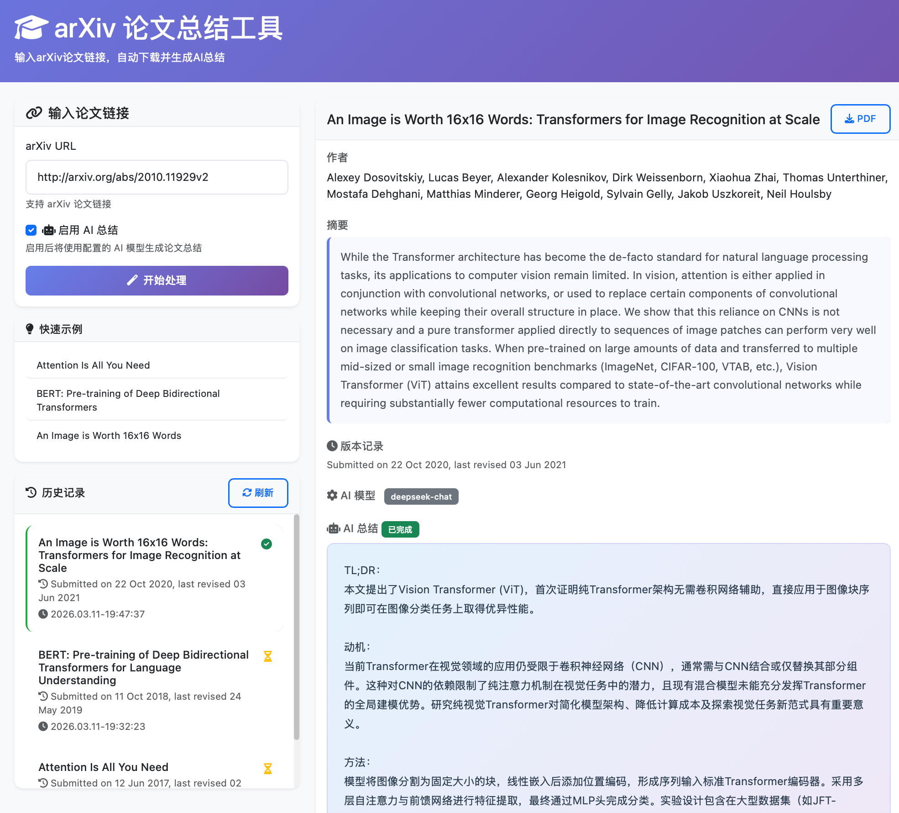

# arXiv 论文总结工具

[English Version](./README_EN.md) | [中文版本](#chinese)

---

<a id="chinese"></a>
# 中文版本

一个适合本地部署的网页工具，支持输入arXiv论文链接，自动下载论文PDF并调用大模型生成总结，同时提供历史记录功能。

## ✨ 功能特性

- 🔗 **支持arXiv链接**：自动识别和解析arXiv论文链接
- 📄 **自动下载**：自动下载PDF论文到本地，智能命名（格式：`年份_论文标题.pdf`）
- 🤖 **AI智能总结**：调用大模型生成论文的结构化中文总结（TL;DR、动机、方法、结果、总结）
- 📖 **全文深度分析**：基于论文完整内容进行深度分析，生成详细的中文分析报告
- 🔄 **可选AI总结**：支持启用/禁用AI总结功能，灵活选择
- 🔄 **重新分析**：支持重新进行AI总结和全文分析，方便更新或修正结果
- 💾 **Markdown导出**：支持将全文分析结果导出为Markdown文件
- 📚 **历史记录**：保存处理历史，支持分页加载，方便查看和管理
- ⏰ **版本记录**：显示论文提交和修订时间
- 📱 **响应式设计**：支持桌面和移动设备
- 🎨 **现代化界面**：简洁美观的用户界面，支持LaTeX公式渲染
- ⚡ **异步处理**：AI总结和全文分析异步生成，不阻塞用户界面
- 🔒 **安全增强**：支持环境变量配置SECRET_KEY，API Key格式验证，线程安全的代理处理

体验网址：http://arxiv-parser.iepose.cn/


> ⚠️ **注意**：演示站点（http://arxiv-parser.iepose.cn/）当前因 API 密钥过期，AI 总结与分析功能暂时不可用。建议克隆本项目到本地，配置自己的 API Key 后部署使用，以获得完整体验。

## 🛠️ 技术栈

- **后端**：Python + Flask
- **前端**：HTML5 + CSS3 + JavaScript
- **数据库**：SQLite（本地存储）
- **论文下载**：arXiv Python库
- **HTTP客户端**：httpx（线程安全的代理处理）

## 📦 安装部署

### 前置要求

- Python 3.7+
- pip 包管理器
- 大模型 API Key

### 安装步骤

#### 推荐方式：使用 Conda

1. **克隆项目**
   ```bash
   git clone https://github.com/wqs111000/arxiv_parser.git
   cd arxiv_parser
   ```

2. **创建并激活 Conda 环境**
   ```bash
   # 自动创建环境并安装依赖
   conda env create -f environment.yml
   
   # 激活环境
   conda activate arxiv_parser
   ```

3. **配置环境变量**
   ```bash
   cp .env.example .env
   # 编辑 .env 文件，填入你的 API Key 并配置安全密钥
   # 例如: OPENAI_API_KEY=sk-... 和 SECRET_KEY=<random-key>
   ```

4. **启动应用**
   ```bash
   python app.py
   ```

### 方式二：使用 Docker

1. **准备环境变量**

   在项目根目录创建（或复制）`.env` 文件，确保至少包含：

   ```bash
   OPENAI_API_KEY=你的_API_Key
   SECRET_KEY=随机生成的密钥（生产环境必填）
   # 如使用 DeepSeek：
   # OPENAI_BASE_URL=https://api.deepseek.com/v1
   # DEFAULT_MODEL=deepseek-chat
   # 如使用 OpenAI：
   # DEFAULT_MODEL=gpt-3.5-turbo
   ```

2. **直接使用 Docker 构建并运行**

   ```bash
   docker build -t arxiv_parser .
   docker run -d \
     --name arxiv_parser \
     -p 5000:5000 \
     -e OPENAI_API_KEY=${OPENAI_API_KEY} \
     -e SECRET_KEY=${SECRET_KEY} \
     -e OPENAI_BASE_URL=${OPENAI_BASE_URL} \
     -e DEFAULT_MODEL=${DEFAULT_MODEL} \
     -e FLASK_PORT=5000 \
     -e TZ=Asia/Shanghai \
     -v $(pwd)/data:/app/data \
     arxiv_parser
   ```

3. **使用 docker-compose**

   已提供 `docker-compose.yml`，在项目根目录执行：

   ```bash
   # 确保当前目录有 .env，包含 OPENAI_API_KEY 等变量
   docker compose up -d
   docker compose down            # 停止并移除容器
   docker compose restart
   docker compose up -d --build   # 后台重启并重建镜像和容器
   docker compose build           # 仅构建镜像，不启动
   ```

### 访问应用

启动后打开浏览器访问：http://localhost:5000

## 📝 使用方法

### 基本流程

1. **配置模型**（首次使用）
   - 复制 `.env.example` 为 `.env`
   - 编辑 `.env` 文件，填入 API 密钥并设置模型
   - 例如：`OPENAI_API_KEY=sk-...` 和 `DEFAULT_MODEL=gpt-3.5-turbo`
   - 生产环境务必设置 `SECRET_KEY` 为强随机值

2. **输入论文链接**：在输入框中粘贴arXiv论文链接
   - 支持格式：`https://arxiv.org/abs/xxxx.xxxxx`
   - 支持格式：`https://arxiv.org/pdf/xxxx.xxxxx`

3. **选择是否启用AI总结**：勾选或取消勾选"启用摘要总结"
   - **启用**：下载论文 + 生成AI总结（异步处理）
   - **禁用**：仅下载论文，可稍后点击"继续完成 AI 总结"

4. **开始处理**：点击"开始处理"按钮
   - 自动下载论文PDF到 `data/pdfs/` 目录
   - 智能命名格式：`年份_论文标题.pdf`

5. **查看结果**：页面显示论文信息和AI总结
   - 显示论文标题、作者、摘要
   - 显示版本记录（提交和修订时间）
   - 显示使用的AI模型
   - 显示AI生成的结构化总结
   - 可下载PDF文件

6. **全文深度分析**
   - 点击"开始全文分析"按钮，基于完整论文内容生成深度分析报告
   - 分析完成后可点击"下载 Markdown"导出结果

7. **重新分析**
   - 点击"重新总结"可重置并重新生成AI总结
   - 点击"重新分析"可重置并重新进行全文分析

8. **历史记录**：查看右侧"历史记录"面板
   - 自动加载并显示所有处理过的论文（支持分页）
   - 点击任意历史记录加载论文详情
   - 加载时自动填充对应的arXiv URL
   - 状态图标显示是否已完成AI总结和全文分析

### 示例链接

- Attention Is All You Need: https://arxiv.org/abs/1706.03762
- BERT: https://arxiv.org/abs/1810.04805
- Vision Transformer: https://arxiv.org/abs/2010.11929

## 🔧 配置说明

### 环境变量

| 变量名 | 说明 | 默认值 | 示例 |
|--------|------|--------|------|
| `OPENAI_API_KEY` | OpenAI API密钥 | 必填 | `sk-...` |
| `SECRET_KEY` | Flask会话加密密钥 | 自动生成 | `<random-hex>` |
| `DEFAULT_MODEL` | 使用的AI模型 | `deepseek-chat` | `gpt-3.5-turbo`, `gpt-4`, `deepseek-chat` |
| `OPENAI_BASE_URL` | API基础URL | `https://api.openai.com/v1` | `https://api.deepseek.com/v1` |
| `FLASK_PORT` | 应用端口 | `5000` | `5001` |

### 模型配置

在 `.env` 文件中配置使用的AI模型：

```bash
# 使用 OpenAI GPT-3.5
OPENAI_API_KEY=your-openai-key
SECRET_KEY=$(python -c "import os; print(os.urandom(24).hex())")
DEFAULT_MODEL=gpt-3.5-turbo

# 使用 OpenAI GPT-4
OPENAI_API_KEY=your-openai-key
SECRET_KEY=$(python -c "import os; print(os.urandom(24).hex())")
DEFAULT_MODEL=gpt-4

# 使用 DeepSeek
OPENAI_API_KEY=your-deepseek-key
SECRET_KEY=$(python -c "import os; print(os.urandom(24).hex())")
OPENAI_BASE_URL=https://api.deepseek.com/v1
DEFAULT_MODEL=deepseek-chat
```

**支持的模型**：
- `gpt-3.5-turbo` - OpenAI GPT-3.5 (性价比高)
- `gpt-4` - OpenAI GPT-4 (更智能但较贵)
- `deepseek-chat` - DeepSeek (国内可用，性价比高)
- 其他兼容 OpenAI API 格式的模型

## 📁 项目结构

```
arxiv_parser/
├── app.py                  # Flask应用主文件
├── prompts.py              # AI提示词统一管理
├── requirements.txt        # Python依赖
├── environment.yml         # Conda环境配置
├── docker-compose.yml      # Docker Compose配置
├── Dockerfile              # Docker镜像配置
├── README.md               # 项目说明
├── .env.example            # 环境变量示例
├── .gitignore              # Git忽略文件
├── templates/
│   └── index.html          # 前端页面
├── static/
│   ├── css/
│   │   └── style.css       # 样式文件
│   └── js/
│       └── app.js          # 前端逻辑
├── data/
│   ├── pdfs/               # 下载的PDF文件（自动创建）
│   └── arxiv_history.db    # SQLite数据库（自动生成）
└── assets/                 # 项目资源文件
```

## 🔍 功能详解

### 论文下载与命名
- 使用arXiv官方Python库下载PDF
- 自动保存到`data/pdfs/`目录
- 智能文件名格式：`{年份}_{论文标题}.pdf`
- 示例：`2017_Attention Is All You Need.pdf`
- 自动清理标题中的非法字符（如 `:`, `/`, `\`, `|`, `?`, `*`, `<`, `>`）
- 避免文件名冲突和文件系统限制
- PDF完整性验证，自动检测并重新下载损坏文件

### AI总结生成
- 基于论文摘要生成结构化中文总结
- 包含5个部分：TL;DR（一句话概括）、动机、方法、结果、总结
- 异步处理，不阻塞用户界面，可实时查看状态
- 支持多种大语言模型（OpenAI GPT-3.5/GPT-4、DeepSeek等）
- 字数控制在300-500字之间，专业简洁
- 线程安全的API调用，支持并发请求

### 全文深度分析
- 基于论文完整PDF内容进行深度分析
- 使用 `qwen-long` 模型处理长文本
- 生成详细的中文分析报告，保存为Markdown格式
- 支持导出下载，文件名与PDF对应
- 异步处理，支持实时状态查看

### 重新分析功能
- 支持重置AI总结状态并重新生成
- 支持重置全文分析状态并重新分析
- 重置后自动开始新的分析流程
- 同时删除本地保存的分析文件

### 版本记录显示
- 自动从arXiv数据中提取版本信息
- 显示论文提交时间和最后修订时间
- 格式示例：`Published 12 Jun 2017, revised 2 Aug 2023`
- 帮助了解论文的更新历史和时效性

### 可选AI总结功能
- 提供"启用摘要总结"复选框
- **启用时**：下载论文 + 立即生成AI总结（异步）
- **禁用时**：仅下载论文，显示"未启用"状态
- 支持后续点击"继续完成 AI 总结"按钮补充生成
- 灵活满足不同使用场景

### 历史记录管理
- 使用SQLite本地数据库存储，无需额外配置
- 保存论文元数据、总结结果和处理状态
- 右侧边栏实时显示历史记录列表（支持分页加载）
- 每个记录显示：标题、版本记录（截断）、完成时间（北京时间）、状态图标
- 点击任意记录自动加载论文详情
- 加载时自动填充对应的arXiv URL到输入框
- 支持状态筛选：已完成（绿色对勾）、处理中（黄色沙漏）

### 时间显示
- 所有时间自动转换为北京时间（UTC+8）
- 格式统一为：`YYYY.MM.DD-HH:MM:SS`
- 示例：`2026.03.11-16:45:30`
- 便于国内用户阅读和理解

### 界面特性
- 响应式设计，完美适配桌面和移动设备
- Bootstrap 5 框架，现代化UI组件
- KaTeX 支持LaTeX公式渲染
- 实时状态更新和自动刷新
- 友好的错误提示和Toast通知
- 加载动画和过渡效果，提升用户体验
- 简洁直观的操作流程，降低使用门槛

### 安全特性
- SECRET_KEY 从环境变量读取，生产环境必须配置
- API Key 格式验证，防止无效请求
- 文件上传大小限制（50MB）
- 线程安全的HTTP客户端，避免竞态条件
- 文件名URL编码，支持中文和特殊字符

## 💡 使用建议

1. **API成本**：注意API调用费用，全文分析使用长文本模型可能消耗较多token
2. **网络连接**：确保可以访问arXiv和LLM API
3. **存储空间**：PDF文件和分析结果会占用本地存储空间
4. **隐私保护**：论文数据和API密钥本地存储，不会上传到服务器
5. **生产部署**：务必设置强随机值的 `SECRET_KEY`，不要使用默认值


## 🚀 高级功能

### 批量处理
可通过修改API接口实现批量论文处理

### 自定义提示词
修改 `prompts.py` 文件中的提示词，定制总结和分析风格

### 其他AI提供商
支持任何兼容OpenAI API格式的服务

## 📄 许可证

MIT License

## 🤝 贡献

欢迎提交Issue和Pull Request！

## 📧 联系

如有问题或建议，请创建GitHub Issue。

---

**注意**：
本项目仅供学习和研究使用，请遵守arXiv和AI服务提供商的使用条款。
主要基于 WorkBuddy，使用 kimi-k2-thinking 模型，采用 vibe coding 开发。
项目参考：https://github.com/dw-dengwei/daily-arXiv-ai-enhanced

---

<a id="chinese"></a>
# 中文版本

一个适合本地部署的网页工具，支持输入arXiv论文链接，自动下载论文PDF并调用大模型生成总结，同时提供历史记录功能。
